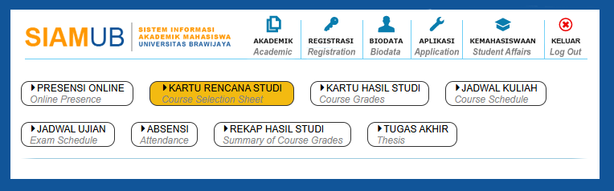

# WAR KRS Mode Styler
 Mengubah tampilan website SIAM menjadi mode WAR

 

 Gunakan Ekstensi Browser Stylus, Tidak perlu menghidupkan Developer Mode

```Stylus
/* ==UserStyle==
@name           siam.ub.ac.id
@namespace      github.com/openstyles/stylus
@version        1.0.0
@description    WAR KRS Mode Website Styler for Universitas Brawijaya
@author         Samuel Alfito Deanova
==/UserStyle== */
:root {
    --primary-p50: #0075C1;
    --primary-p90: #003961;
    --secondary-s30: #f3ba11;
    --secondary-s50: #ED8B00;
    --neutral-white: #FFFAFA;
    --neutral-n30: #CCCCCC;
    --neutral-n60: #666666;
    --neutral-black: #0D0D0D;
    --gradient: linear-gradient(to right, var(--primary-purple), var(--primary-blue));
}

@-moz-document url-prefix("https://siam.ub.ac.id/") {
    html > body > table:nth-of-type(2) > tbody > tr:nth-of-type(1) > td:nth-of-type(2) > div:nth-of-type(1) {
        display:none;
    }
    
    html > body > table:nth-of-type(2) > tbody > tr:nth-of-type(1) > td:nth-of-type(2) > table:nth-of-type(1) > tbody > tr:nth-of-type(n+2) {
        display:none;
    }
    
    html > body > table:nth-of-type(2) > tbody > tr:nth-of-type(1) > td:nth-of-type(2) > table:nth-of-type(1) > tbody > tr:nth-of-type(1) > td:nth-of-type(-n+3) {
        display:none;
    }
    
    html > body > table:nth-of-type(2) > tbody > tr:nth-of-type(1) > td:nth-of-type(2) > table:nth-of-type(1) > tbody > tr:nth-of-type(1) > td > table > tbody {
        display: flex;
        flex-direction: row;
        flex-wrap: wrap;
        gap: 20px;
    }
    html > body > table:nth-of-type(2) > tbody > tr:nth-of-type(1) > td:nth-of-type(2) > table:nth-of-type(1) > tbody > tr:nth-of-type(1) > td > table > tbody > tr {
        border: 1px solid;
        border-radius: 10px;
        padding: 0 10px
    }
    
    html > body > table:nth-of-type(2) > tbody > tr:nth-of-type(1) > td:nth-of-type(2) > table:nth-of-type(1) > tbody > tr:nth-of-type(1) > td > table > tbody > tr:nth-of-type(3) {
        background-color: var(--secondary-s30);
        padding: 0 14px;
    }
    
    html > body > table:nth-of-type(2) > tbody > tr:nth-of-type(1) > td:nth-of-type(2) > table:nth-of-type(1) > tbody > tr:nth-of-type(1) > td > table > tbody > tr:nth-of-type(even) {
        display:none;
    }
}
```